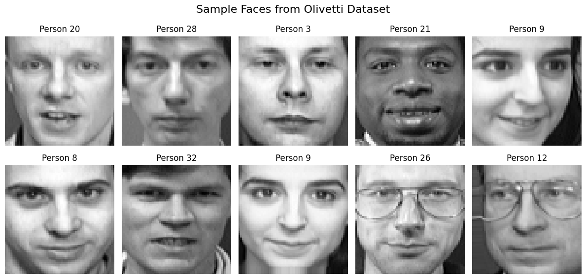
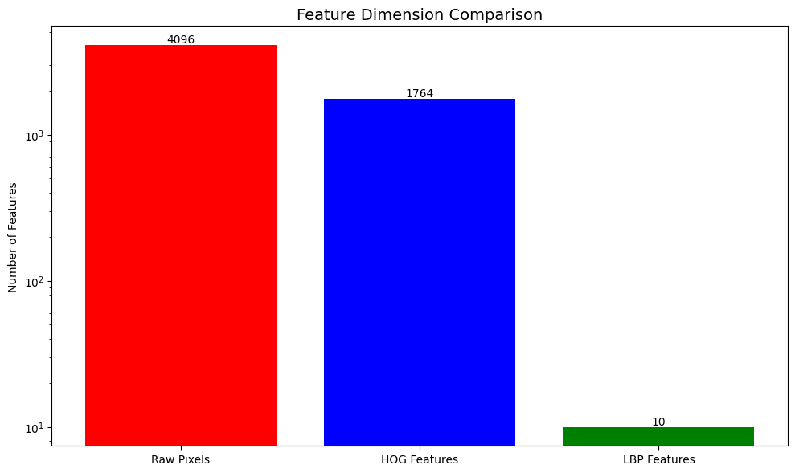
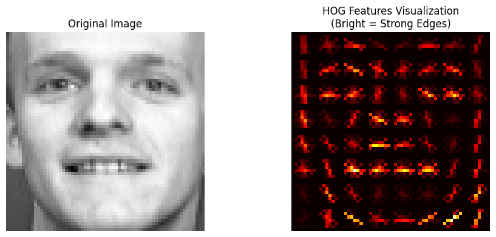
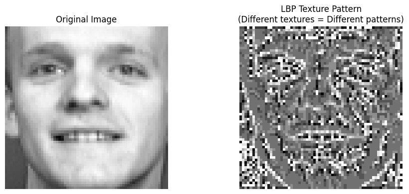
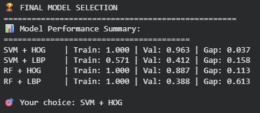

# Computer Vision with Classical Machine Learning

[Back to the main portfolio](../README.md)

## Project overview

This project applies a complete classical machine-learning workflow to an image-classification problem. It uses the Olivetti Faces dataset to compare raw pixel values with two handcrafted feature-extraction techniques: Histogram of Oriented Gradients (HOG) and Local Binary Patterns (LBP).

Several machine-learning models are evaluated to determine which combination of features and classifier provides the strongest validation performance and the best generalization.

## Problem statement

How can traditional machine-learning algorithms classify face images when they cannot learn visual features automatically like a convolutional neural network?

The project addresses this problem by converting each image into a numerical feature vector and comparing how well different feature representations support classification.

## Dataset

The notebook uses the **Olivetti Faces dataset**, which is loaded through `sklearn.datasets.fetch_olivetti_faces()`.

Dataset characteristics:

- 400 grayscale face images
- 40 individuals
- 10 images per individual
- Image size: 64 × 64 pixels
- 40 target classes

The dataset is downloaded automatically by scikit-learn when the notebook is run. It should not be uploaded manually to this repository.

```python
from sklearn.datasets import fetch_olivetti_faces

faces = fetch_olivetti_faces(shuffle=True, random_state=42)
```

## Approach

1. Load and inspect the Olivetti Faces dataset.
2. Visualize sample images and class labels.
3. Flatten images into raw-pixel feature vectors.
4. Extract HOG features to represent edge orientation and shape.
5. Extract LBP histograms to represent local texture.
6. Split the dataset into training and validation sets.
7. Scale features where appropriate.
8. Train and compare classical classifiers.
9. Measure training accuracy, validation accuracy, and the generalization gap.
10. Use cross-validation and overfitting analysis to support model selection.

## Feature engineering

### Raw pixels

Each 64 × 64 image contains 4,096 raw pixel features. Raw pixels preserve all intensity values but can be sensitive to shifts, lighting changes, and image alignment.

### Histogram of oriented gradients

Histogram of Oriented Gradients, or HOG, summarizes local edge directions and shape information.

In this notebook, HOG reduces each image from 4,096 raw pixel values to 1,764 features while retaining useful facial structure.

### Local binary patterns

Local Binary Patterns, or LBP, describe local texture by comparing each pixel with its surrounding neighborhood.

The resulting LBP codes are summarized as histograms and used as model inputs.

## Models evaluated

- Support Vector Machine
- Random Forest
- K-Nearest Neighbors
- Gaussian Naive Bayes

The primary model-selection comparison focuses on Support Vector Machine and Random Forest models trained with HOG and LBP features.

## Results

| Model | Features | Training Accuracy | Validation Accuracy | Generalization Gap |
|---|---|---:|---:|---:|
| SVM | HOG | 1.000 | 0.963 | 0.037 |
| SVM | LBP | 0.571 | 0.412 | 0.158 |
| Random Forest | HOG | 1.000 | 0.887 | 0.113 |
| Random Forest | LBP | 1.000 | 0.388 | 0.613 |

## Selected model

**SVM with HOG features** was selected as the strongest model because it achieved the highest validation accuracy, **96.3%**, while maintaining the smallest generalization gap among the compared models.

## Results and Visualizations

### Olivetti Faces Samples



### Feature-Dimension Comparison



### HOG Feature Results



### LBP Feature Results



### Model Selection



Additional outputs are available in the [`Results`](Results/) folder.

## Key findings

- Feature engineering strongly affects classical computer-vision performance.
- HOG features captured facial shape and edge structure more effectively than LBP features for this dataset.
- High training accuracy alone does not guarantee a useful model.
- The Random Forest model using LBP features strongly overfit the training data.
- Validation performance, cross-validation, and the generalization gap provide a more reliable basis for model selection.
- SVM combined with HOG provided the strongest overall performance.

## Technologies used

- Python
- Jupyter Notebook
- Google Colab
- NumPy
- Matplotlib
- Seaborn
- OpenCV
- scikit-image
- scikit-learn

## How to Run

### In Google Colab

1. Open [`L03_A_TobiasChow_ITAI_1378.ipynb`](L03_A_TobiasChow_ITAI_1378.ipynb).
2. Open or upload the notebook in Google Colab.
3. Run all cells from top to bottom.
4. The Olivetti Faces dataset will be downloaded automatically by scikit-learn.
5. Review the generated feature visualizations and model-comparison results.

### On a local environment

```bash
git clone https://github.com/TobiasC05/Tobias-C-AI-Portfolio.git
cd Tobias-C-AI-Portfolio/Project3-ClassicalMachineLearning
pip install numpy matplotlib seaborn opencv-python-headless scikit-image scikit-learn jupyter
jupyter notebook L03_A_TobiasChow_ITAI_1378.ipynb
```

## Repository Contents

```text
Project3-ClassicalMachineLearning/
├── README.md
├── L03_A_TobiasChow_ITAI_1378.ipynb
└── Results/
    ├── FeatureDimensionComp.png
    ├── HOGResults.png
    ├── LBPResults.png
    ├── OlivettiResults.png
    └── modelselection.png
```

## Author

**Tobias Chow**  
ITAI 1378 – Computer Vision
