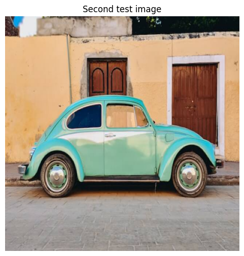
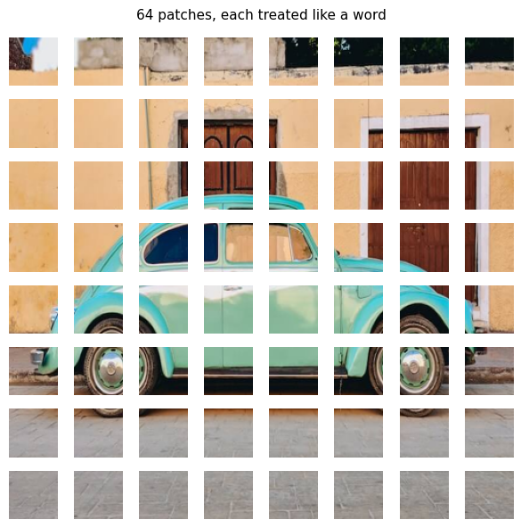
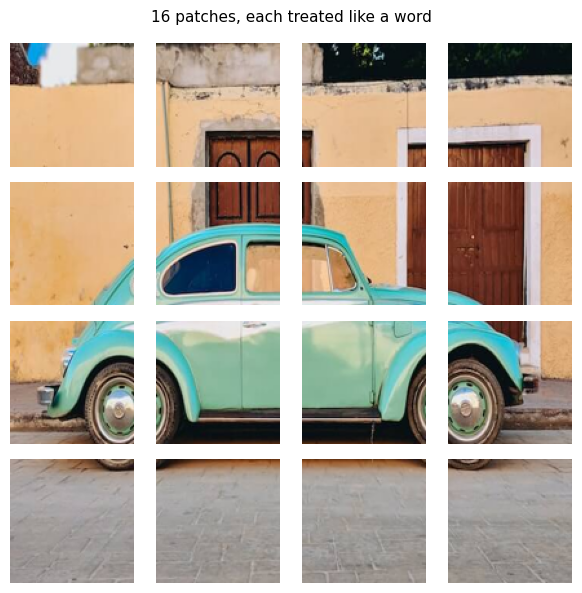
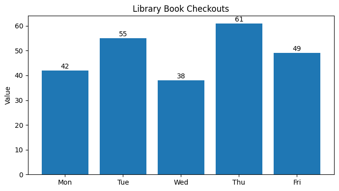
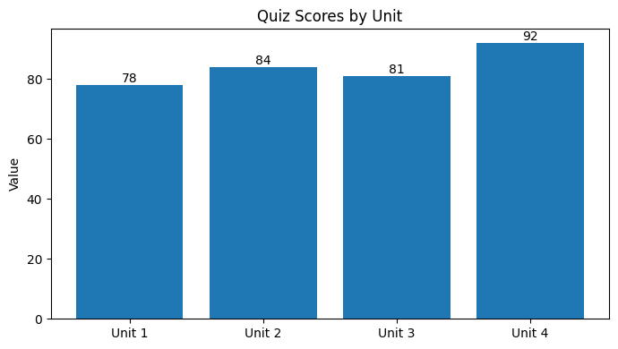
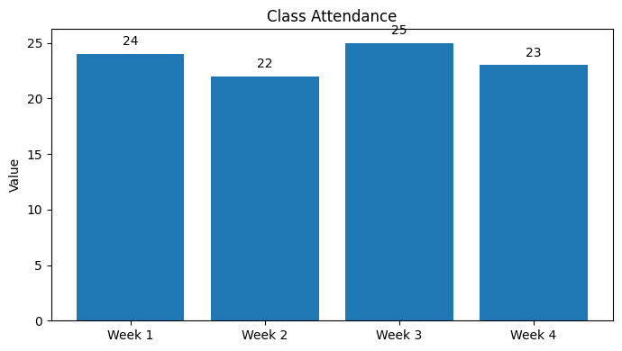
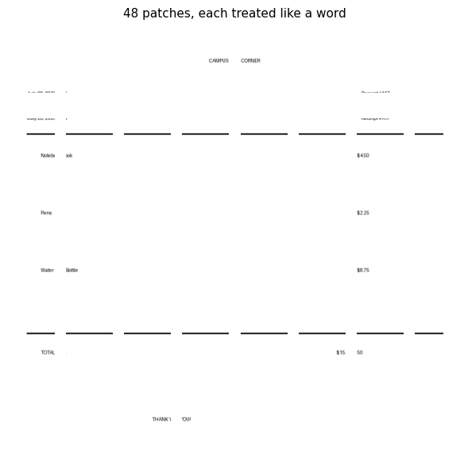
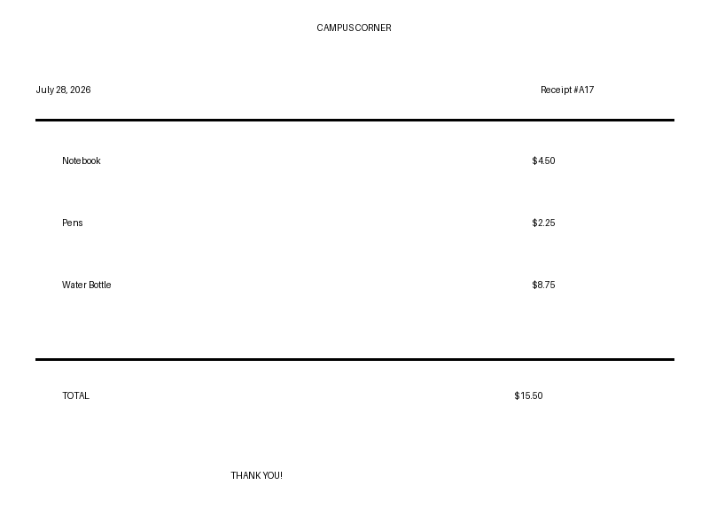

# Vision transformers and vision-language models

[Back to the main portfolio](../README.md)

## Project overview

This project explores Vision Transformers, or ViTs, and Vision-Language Models, or VLMs.

The notebook demonstrates how a Vision Transformer divides an image into patches and how a Vision-Language Model combines visual information with natural-language instructions. A single open-weight model is prompted to perform several tasks, including image description, visual question answering, object counting, accessibility alt-text generation, chart reading, and reliability auditing.

The project also investigates an important limitation of VLMs: they can produce confident, fluent answers even when they misread or invent visual information.

This project was completed for **ITAI 1378 – Computer Vision**.

## Problem statement

How reliably can a small Vision-Language Model understand images and respond to different visual tasks using natural-language prompts?

This project examines three related questions:

1. How does a Vision Transformer process an image as a sequence of patches?
2. Can one VLM perform multiple computer-vision tasks without retraining?
3. Is the model reliable enough to use for workplace tasks without human review?

## Learning objectives

- Understand how Vision Transformers divide images into patches.
- Compare smaller and larger image-patch sizes.
- Load and use an open-weight Vision-Language Model.
- Ask factual, detailed, and reasoning questions about an image.
- Use prompts to switch between classification, counting, reading, and description tasks.
- Generate accessibility alt text.
- Extract information from charts with known ground truth.
- Test a model for consistency using rephrased prompts.
- Identify errors and hallucinations.
- Conduct a professional deployment audit.
- Compare VLMs of different sizes.

## Vision transformer patch processing

A Vision Transformer does not process an image as one indivisible object. It divides the image into fixed-size square patches.

Each patch is converted into a numerical representation and treated similarly to a token in a sentence. The transformer then analyzes relationships between the patches using attention.

A simplified workflow is:

```text
Input Image
    ↓
Divide Image into Patches
    ↓
Convert Patches into Numerical Tokens
    ↓
Add Positional Information
    ↓
Transformer Attention Layers
    ↓
Visual Representation
```

The notebook compares patch sizes such as:

- 48 × 48 pixels
- 96 × 96 pixels

Smaller patches preserve more detailed spatial information but create a longer sequence for the model to process. Larger patches create a shorter sequence but may combine or lose small visual details.

## Vision-language model

The primary model used in this project is:

**HuggingFaceTB/SmolVLM-500M-Instruct**

SmolVLM combines three main components:

```text
Image
  ↓
Vision Encoder
  ↓
Projector
  ↓
Language Model
  ↓
Natural-Language Response
```

### Vision encoder

The vision encoder processes the image and extracts visual features.

### Projector

The projector translates visual features into a representation that the language model can understand.

### Language model

The language model combines the visual representation with the user’s prompt and generates a natural-language answer.

## Model tasks

The same VLM is used for several tasks by changing only the prompt.

### Image description

The model generates a sentence describing the visible image.

### Visual question answering

The model answers questions about:

- Objects
- Colors
- Positions
- Counts
- Background details
- Possible mood or context

### Classification

The prompt can require the model to return a short class label.

### Object counting

The prompt can require the model to return only the number of visible objects.

### Object listing

The model can list visible objects using a constrained output format.

### Text and chart reading

The model is asked to identify labels, categories, and numerical values from generated charts.

## Image and data handling

This project does not train or fine-tune a model on a large dataset. It performs inference using sample images and controlled test images.

The notebook uses:

- A sample cat image
- A sample car image
- ViT-style patch grids
- A generated food-truck sales chart
- A generated library-checkout chart
- A generated quiz-score chart
- A generated class-attendance chart
- A generated receipt for bonus testing
- An additional campus image for patch analysis

The sample images are downloaded when the notebook runs. The charts and receipt are generated programmatically, which provides known ground-truth values for evaluating the model.

Large datasets and pretrained model-weight files are not stored in this repository. The model weights are downloaded automatically from Hugging Face.

## Approach

### 1. Configure the environment

The notebook installs the required Hugging Face libraries and detects whether a GPU is available.

It supports:

- NVIDIA GPU execution
- CPU fallback

### 2. Visualize image patches

The cat and car images are resized and divided into patch grids.

The project compares how different patch sizes affect the amount of visual detail available in each token.

### 3. Load SmolVLM

The notebook loads `SmolVLM-500M-Instruct` using the Hugging Face Transformers library.

A reusable `ask()` function accepts:

- An image
- A text question
- A maximum response length

The function returns the model’s answer.

### 4. Interview an image

The model is asked three levels of questions:

1. A simple factual question
2. A detailed visual question
3. A reasoning or interpretation question

This demonstrates that factual questions are generally easier than questions requiring interpretation or inference.

### 5. Use one model for multiple jobs

The same model performs different jobs through prompt changes alone:

- Classification
- Counting
- Object listing
- Image description
- Visual question answering

Output constraints such as “answer with one word” or “answer with just a number” make the model easier to integrate into software workflows.

### 6. Generate accessibility alt text

The model is tested with both weak and professional prompts.

A weak prompt asks:

```text
Describe this image.
```

A stronger prompt asks for concise, specific alt text suitable for a screen-reader user.

The improved prompt produces shorter and more useful descriptions, although human review is still necessary before publication.

### 7. Read a chart with known ground truth

The notebook creates a food-truck sales chart using these known values:

| Month | Units Sold |
|---|---:|
| January | 120 |
| February | 95 |
| March | 140 |
| April | 180 |
| May | 165 |
| June | 210 |

Because the chart is generated inside the notebook, the correct values are known before the model is questioned.

This makes it possible to compare the VLM’s responses with verified ground truth.

### 8. Conduct a hallucination hunt

The model is tested with misleading or assumption-based questions.

The purpose is to determine whether the VLM:

- Corrects a false assumption
- Admits that information is not visible
- Produces an ordinary reading error
- Invents a detail that is not present

### 9. Conduct a deployment audit

The independent audit evaluates whether the VLM should be used to describe educational charts for students.

Three controlled charts are created:

- Library Book Checkouts
- Quiz Scores by Unit
- Class Attendance

The same task is asked using three differently worded prompts for each chart.

The model’s responses are compared with the known values to evaluate consistency and reliability.

## Deployment audit results

### Library book checkouts

Ground truth:

| Day | Checkouts |
|---|---:|
| Monday | 42 |
| Tuesday | 55 |
| Wednesday | 38 |
| Thursday | 61 |
| Friday | 49 |

Correct maximum: **Thursday, 61**

Correct minimum: **Wednesday, 38**

The model correctly identified Wednesday as the minimum but repeatedly reported Thursday as approximately 90 or 91 instead of 61.

### Quiz scores by unit

Ground truth:

| Unit | Score |
|---|---:|
| Unit 1 | 78 |
| Unit 2 | 84 |
| Unit 3 | 81 |
| Unit 4 | 92 |

Correct maximum: **Unit 4, 92**

Correct minimum: **Unit 1, 78**

One prompt produced all four values correctly. Other phrasings confused the ranking or associated values with the wrong units.

### Class attendance

Ground truth:

| Week | Attendance |
|---|---:|
| Week 1 | 24 |
| Week 2 | 22 |
| Week 3 | 25 |
| Week 4 | 23 |

Correct maximum: **Week 3, 25**

Correct minimum: **Week 2, 22**

The model produced inconsistent responses and incorrectly assigned several attendance values.

## Deployment recommendation

The VLM should **not be deployed unsupervised** for educational chart interpretation.

The audit showed that:

- Answers changed when the prompt was rephrased.
- Numerical values were sometimes invented or misread.
- Categories and values were occasionally mismatched.
- Fluent responses could appear trustworthy even when incorrect.

The model may be useful as a limited support tool when:

- A human reviews every answer.
- The original chart remains available.
- Ground-truth values can be checked.
- Users are warned that numerical extraction may be inaccurate.

## Errors versus hallucinations

An ordinary error occurs when the model attempts to read something that exists but gives the wrong answer.

A hallucination occurs when the model invents an object, value, label, or detail that is not present in the image.

Hallucinations are especially risky because the model may express invented information clearly and confidently.

## Bonus investigations

### Smaller model comparison

The optional bonus compares:

- `SmolVLM-500M-Instruct`
- `SmolVLM-256M-Instruct`

The smaller model requires less memory and computation, but its responses are generally less detailed and less capable on reasoning questions.

### Receipt reading

A custom receipt is generated with known prices and totals.

The model correctly extracted:

- Receipt total: **15.50**
- Price of pens: **2.25**

This demonstrates that the model can read controlled document text successfully in some cases.

### Small-detail patch test

A receipt number is placed within a larger image and displayed using a 96-pixel patch grid.

The model correctly read the receipt number as **A17**, showing that it could identify a small detail in that controlled example.

## Results and visualizations

### Car patch grid


### Car test image



### Car patch grid – first comparison



### Car patch grid – second comparison



### Food-Truck sales chart


### Library book checkouts



### Quiz scores



### Class attendance



### Campus patch grid



### Bonus campus image



Additional outputs and model responses are available in the executed notebook.

## Key findings

- Vision Transformers process images as sequences of patches.
- Smaller patches preserve more detail but require more computation.
- A single VLM can perform several visual tasks through prompt changes.
- Prompt wording and output constraints strongly affect responses.
- Professional alt-text prompts produce shorter and more useful descriptions than general prompts.
- Known ground truth is essential when evaluating chart-reading systems.
- Fluent language does not guarantee factual visual understanding.
- The model’s answers were sometimes inconsistent across rephrased prompts.
- The model should not be trusted for unsupervised numerical chart interpretation.
- Human review remains necessary for accessibility, education, finance, and other high-impact applications.
- Smaller models may reduce computing requirements at the cost of response quality.

## Limitations

- The project evaluates only a small number of images and charts.
- The model is not fine-tuned for the tested tasks.
- The deployment audit uses simple generated charts.
- Results may vary across different model versions and software versions.
- Small text and numerical values may be misread.
- Prompt changes may produce inconsistent answers.
- The model may hallucinate information that is not visible.
- Successful performance on one controlled image does not guarantee reliable performance on unfamiliar images.
- No formal benchmark dataset is used.
- The project relies mainly on qualitative analysis and controlled ground-truth comparisons.

## Possible improvements

Future work could include:

- Testing a larger and more diverse image collection
- Calculating exact chart-reading accuracy
- Creating a structured hallucination-rate metric
- Comparing additional VLMs
- Testing larger SmolVLM versions
- Evaluating OCR-focused models
- Repeating each prompt several times
- Testing more complex charts and documents
- Adding confidence or uncertainty reporting
- Creating an automated ground-truth evaluation pipeline
- Testing whether improved prompts reduce numerical errors
- Comparing VLM chart reading with dedicated OCR and document-understanding systems
- Building a human-review interface for approving or correcting model responses

## Technologies used

- Python
- Jupyter Notebook
- Google Colab
- PyTorch
- Hugging Face Transformers
- Hugging Face Accelerate
- SmolVLM
- Pillow
- Matplotlib

## Requirements

Install the required packages using:

```bash
pip install -r requirements.txt
```

The `requirements.txt` file should contain:

```text
torch
transformers
accelerate
Pillow
matplotlib
jupyter
```

Python standard-library modules such as `urllib` and `gc` do not need to be included in `requirements.txt`.

## How to Run

### Option 1: On Google Colab

1. Open [`L08_Chow_Tobias_ITAI1378.ipynb`](L08_Chow_Tobias_ITAI1378.ipynb).
2. Open or upload the notebook in Google Colab.
3. Select **Runtime > Change runtime type**.
4. Select a **T4 GPU** when available.
5. Run the package-installation cell.
6. Run all cells from top to bottom.
7. Allow the model weights and sample images to download.
8. Confirm that every question, response, chart, and patch grid is visible.
9. Review the model’s answers against the known chart values.

The notebook can also run on a CPU, although responses will take longer.

### Option 2: Run on local environment 

Clone the portfolio repository:

```bash
git clone https://github.com/TobiasC05/Tobias-C-AI-Portfolio.git
```

Move into the Project 8 folder:

```bash
cd Tobias-C-AI-Portfolio/Project8-VITandVLM
```

Install the dependencies:

```bash
pip install -r requirements.txt
```

Start Jupyter Notebook:

```bash
jupyter notebook L08_Chow_Tobias_ITAI1378.ipynb
```

Run the cells in order. An internet connection is required the first time the model weights and sample images are downloaded.

## Repository Contents

```text
Project8-VITandVLM/
├── README.md
├── requirements.txt
├── L08_Chow_Tobias_ITAI1378.ipynb
└── Results/
    ├── bonuscampus.png
    ├── bookcheckout.png
    ├── campuspatch.png
    ├── carpatch1.png
    ├── carpatch2.png
    ├── cartest.png
    ├── catpatch.png
    ├── classattendance.png
    ├── foodtruckrevenues.png
    └── quizscores.png
```

## Attribution

The companion lab materials were authored by **Patricia McManus** for the AI and Robotics Program at Houston City College.

The completed notebook contains the student’s implementation, experiments, observations, reliability audit, and reflection responses.

## Author

**Tobias Chow**  
ITAI 1378 – Computer Vision
